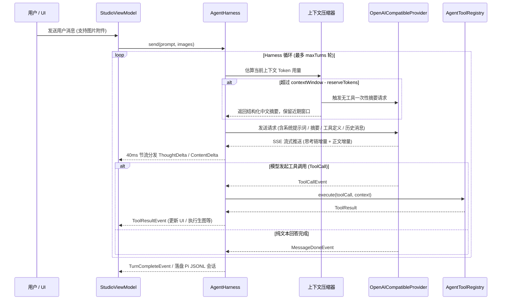
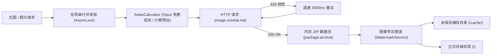
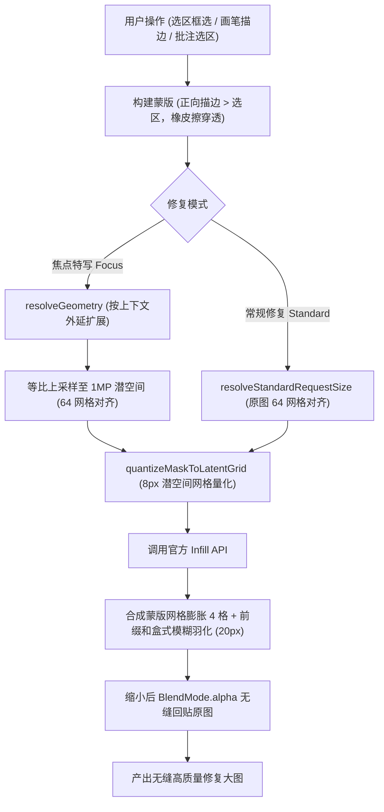
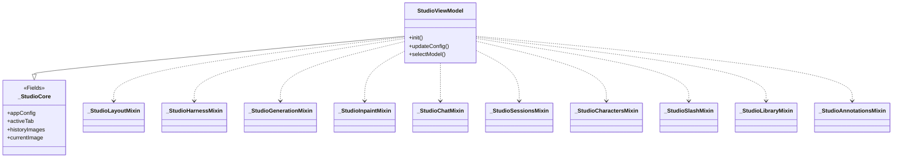

# NovelAI Harness — 系统架构设计与技术文档

本文档详细记录 **NovelAI Harness** 的系统架构设计、工程分层、模块职责划分与核心业务管线设计，作为系统结构与设计的单一事实源。

---

## 1. 系统分层架构 (Layered Architecture)

项目采用标准的清晰分层架构，分为 **Core Harness**、**Data Layer** 与 **UI Presentation Layer**，遵循高内聚、低耦合原则：


- **Core Harness Layer (`lib/core/`)**：轻量级 AI Agent 运行时。不依赖 Flutter UI 控件，通过事件流（Event Stream）驱动，负责对话生命周期、瞬态错误退避重试、Token 驱动的自适应上下文压缩、工具注册与执行、以及技能动态加载。
- **Data Layer (`lib/data/`)**：负责外部 API 通信、数据持久化、复杂数学/图像处理与底层服务。包含 NovelAI 协议适配、焦点重绘几何算法、DCT 盲水印管道、32万+ Danbooru 离线字典检索等核心服务。
- **UI Presentation Layer (`lib/ui/`)**：纯声明式 Flutter 界面，严格践行 MVVM 模式。视图（View）只负责布局、用户手势与视觉渲染，所有业务状态与事件分发完全由 `StudioViewModel`（通过 Mixin 分部组合）集中调度。

---

## 2. 目录结构与完整模块清单

```text
Novelai-harness/
├── lib/
│   ├── main.dart                               # 桌面端初始化、窗口托管与应用启动入口
│   │
│   ├── core/                                   # 极简 AI Harness 运行时
│   │   └── harness/
│   │       ├── types.dart                      # 消息、事件流、角色、工具调用与附件数据模型
│   │       ├── agent_harness.dart              # 核心 Agent 调度器 (多轮对话/工具执行/自适应压缩/瞬态重试/耗尽收尾)
│   │       ├── session_recorder.dart           # 会话记录器抽象接口 (Pi 格式落盘钩子)
│   │       ├── presets/
│   │       │   └── agent_preset.dart           # Agent 预设模型 (系统提示词/可用Skills/工具与参数权限白名单)
│   │       ├── providers/
│   │       │   ├── llm_provider.dart           # LLM 提供商通用接口抽象
│   │       │   └── openai_provider.dart        # OpenAI 兼容协议流式实现 (SSE 解析、思考链状态机提取与 Token 统计)
│   │       ├── tools/
│   │       │   ├── agent_tool.dart             # 工具抽象基类、执行上下文与工具注册中心
│   │       │   ├── annotation_tools.dart       # 画板批注五件套工具与覆盖层离屏绘制 (view/add/update/remove/clear)
│   │       │   ├── ask_user_tool.dart          # 向用户提出结构化单选/多选/填空问题 (ask_user)
│   │       │   ├── canvas_view_tool.dart       # 画板历史图片查看工具 (view_canvas_image，支持索引与覆盖层)
│   │       │   ├── character_prompt_tools.dart  # 多角色提示词增删改查四件套工具
│   │       │   ├── danbooru_search_tools.dart  # Danbooru 离线/在线语义搜索与 NPMI 画师推荐工具
│   │       │   ├── load_skill_tool.dart        # Pi 标准按需加载专业技能工具 (load_skill)
│   │       │   ├── novelai_tools.dart          # 生图、新版超分、官方标签联想与账号查询工具
│   │       │   ├── novelai_inpaint_tool.dart   # 局部修复与焦点特写工具 (novelai_inpaint / get_inpaint_geometry)
│   │       │   ├── ai_edit_image_tool.dart    # AI 整图编辑工具 (ai_edit_image，外部多模态模型整图重绘)
│   │       │   ├── prompt_library_tools.dart   # 词组合预设库增删改查工具
│   │       │   ├── studio_params_tool.dart     # 工作台生图参数查询与批量同步修改工具
│   │       │   └── vision_image_codec.dart     # 视觉附件压缩 (最长边 1024 等比缩小 PNG) 与 MIME 嗅探
│   │       └── skills/
│   │           └── skills.dart                 # 内置技能库 (V5 自然语言架构师、艺术总监、Danbooru 标签大师)
│   │
│   ├── data/                                   # 数据与服务层
│   │   ├── models/
│   │   │   ├── novelai_models.dart             # 聚合导出 barrel 文件 (保持模块引用解耦)
│   │   │   ├── inpaint_models.dart             # 局部修复与焦点特写模型 (InpaintMode/Geometry/BrushStroke/Params)
│   │   │   ├── nai_catalog.dart                # NaiModel/采样器/噪声调度/分辨率预设枚举 (含 inpaintModelId)
│   │   │   ├── nai_character_prompt.dart       # 多角色提示词模型、位置布局与坐标量化
│   │   │   ├── nai_generation_params.dart      # 生图参数实体与官方 Payload 构建 (含 toInfillApiPayload)
│   │   │   ├── nai_image_result.dart           # 图片生成结果、流式进度帧与导出标记 (含角标文案)
│   │   │   ├── nai_account_info.dart           # 账号等级、V5 体力池余量与官方 Tag 联想模型
│   │   │   ├── nai_prompt_presets.dart         # 质量词/UC 预设与提示词文本后处理
│   │   │   ├── prompt_library_models.dart     # 词组合预设分类常量与 PromptComboEntry 实体
│   │   │   ├── llm_models.dart                # LLM 供应商、模型卡片、思考参数格式与图像输出能力
│   │   │   ├── tag_models.dart                 # Danbooru 标签分类、联想条目与 NovelAI Token 结构
│   │   │   ├── image_annotation.dart           # 图像批注模型 (rect 选区/point 图钉/global，归一化坐标+调色板)
│   │   │   ├── canvas_board_models.dart        # 自由大画布节点模型 (图片卡/便利贴/连线/视口矩阵，含 JSON 序列化)
│   │   │   └── image_metadata_models.dart      # 图像元数据模型与水印配置实体 (WatermarkConfig)
│   │   ├── services/
│   │   │   ├── novelai_service.dart            # NovelAI 官方 HTTP 通信、并发锁与纯内存 ZIP 解包
│   │   │   ├── anlas_calculator.dart           # 现代 Anlas 消耗计算单一事实源 (Opus 免费档/分档超分计费)
│   │   │   ├── inpaint_service.dart            # 焦点特写几何计算 (1MP 潜空间超采样/64 步长)、量化蒙版与无损回贴
│   │   │   ├── watermark_service.dart          # 图像导出管道单一事实源 (可见水印/自动对比度/智能选位/Koch-Zhao DCT 盲水印)
│   │   │   ├── image_edit_service.dart         # 外部绘图模型整图编辑服务 (OpenAI 兼容 /chat/completions 传图返图)
│   │   │   ├── image_metadata_service.dart     # PNG Chunks 与 Alpha LSB 隐写读取、元数据脱敏抹除与注入
│   │   │   ├── tag_dictionary_service.dart     # 32万+ Danbooru 离线词库检索、多模态反查与缓存服务 (后台 Isolate)
│   │   │   ├── prompt_ast_engine.dart          # NovelAI 提示词 AST 分词、权重增减、注释禁用与 SD 语法转换引擎
│   │   │   ├── prompt_library_service.dart     # 词组合预设库本地持久化、检索与 JSON 导入导出
│   │   │   ├── config_service.dart             # 本地配置与 ~/.pi/agent/novelai.json 自动识别与内置预设同步
│   │   │   ├── session_log_service.dart        # Pi 官方标准 JSONL 格式会话记录与多分支恢复
│   │   │   ├── usage_ledger_service.dart       # Token 增量账本记录、去重与多维聚合统计
│   │   │   ├── llm_model_fetcher.dart          # 在线拉取远程 LLM 模型列表与能力元数据自动解析
│   │   │   ├── models_dev_catalog.dart         # models.dev 在线模型能力目录拉取与模糊匹配
│   │   │   └── window_state_service.dart       # 桌面端窗口尺寸、坐标与最大化状态监听与防抖持久化
│   │   └── repositories/
│   │       └── novelai_repository.dart         # 图片落盘存储、历史索引、自动保存缓存管理与生成管线聚合
│   │
│   └── ui/                                     # 表现层 (Flutter Widgets & MVVM)
│       ├── core/
│       │   ├── theme/
│       │   │   └── app_theme.dart              # 暗黑工作台主题体系、Notion 风格调色板与全局阴影
│       │   └── widgets/
│       │       ├── resizable_split_view.dart   # 可自由拖动分割线的三栏自适应布局容器
│       │       ├── custom_title_bar.dart       # 顶部沉浸式自定义标题栏 (窗口拖拽与最小化/最大化/关闭)
│       │       ├── context_menu.dart           # Notion 风格右键菜单 (图标、快捷键与分隔线)
│       │       └── smooth_scroll_controller.dart # 平滑滚轮控制器 (重写 pointerScroll 为 160ms 平滑滑动)
│       └── features/
│           ├── settings/                       # 全局配置管理中枢
│           │   ├── views/
│           │   │   └── settings_dialog.dart    # 全局设置弹窗壳 (五栏导航 + IndexedStack 装配)
│           │   └── widgets/
│           │       ├── settings_shared.dart    # 设置域共享件 (卡片/分组标题/操作钮/密钥框/下拉菜单)
│           │       ├── general_settings_tab.dart # 常规页：服务凭证、存储目录、自动保存与免点保护开关
│           │       ├── models_settings_tab.dart # 模型页：LLM 供应商管理、模型卡片、在线拉取与 AI 绘图模型配置
│           │       ├── presets_settings_tab.dart # 预设页：预设 CRUD、系统提示词、可用技能与工具权限白名单
│           │       ├── defaults_settings_tab.dart # 默认页：出厂默认生图参数与 Agent 轮数限制
│           │       ├── bill_settings_tab.dart  # 账单页：Token 用量多维账本与明细表格
│           │       ├── model_card.dart         # 模型小卡片 (选中态/能力胶囊/参数配置)
│           │       ├── model_profile_dialog.dart # 单模型档案弹窗 (上下文长度/思考格式/图像输出能力配置)
│           │       ├── skill_card.dart          # 技能卡片 (启用开关/导出/编辑)
│           │       ├── skill_editor_dialog.dart  # 自定义技能编辑弹窗 (SKILL.md 导入导出)
│           │       ├── tool_card.dart           # 工具卡片 (启用开关/Schema 查看)
│           │       └── tool_editor_dialog.dart  # 自定义模板工具编辑弹窗
│           └── studio/                         # 核心工作台功能区
│               ├── view_models/                # Studio 状态管理中枢 (Mixin 分部架构)
│               │   ├── studio_view_model.dart  # 状态管理中枢：核心状态 Mixin + ViewModel 主体初始化与桥接
│               │   ├── studio_vm_layout.dart    # 布局分部：三栏分割线拖拽防抖落盘与侧栏页签切换
│               │   ├── studio_vm_harness.dart   # Harness 分部：工具装配/LLM切换/思考强度切换/预设与技能管理
│               │   ├── studio_vm_generation.dart # 生图分部：生图/新版超分/实时预览/体力池与统一落图管线
│               │   ├── studio_vm_inpaint.dart   # 修复分部：工具切换/描边增删/批注转修复选区与执行流水线
│               │   ├── studio_vm_chat.dart      # 对话分部：多轮对话/图片附件/ask_user提问/付费确认/通知节流
│               │   ├── studio_vm_sessions.dart  # 会话分部：会话切换/新建/重命名/删除与消息树回溯
│               │   ├── studio_vm_characters.dart # 角色分部：多角色提示词 CRUD 与画板定位同步
│               │   ├── studio_vm_slash.dart     # 斜杠分部：斜杠指令分发与参数解析
│               │   ├── studio_vm_library.dart  # 词库分部：词组合预设库检索/增删改/导入导出与一键应用
│               │   ├── studio_vm_annotations.dart # 批注分部：自由大画布节点/便利贴 CRUD 与批注持久化同步
│               │   ├── chat_checkpoints.dart   # 消息树分支检查点 (回溯视图数据模型)
│               │   ├── param_snapshot_journal.dart # 生图参数快照日志 (记录 Agent 参数修改差异)
│               │   └── slash_command_catalog.dart # 内置斜杠指令目录单一事实源 (自动补全与 /help 共享)
│               ├── views/
│               │   └── studio_view.dart        # 工作台主界面：三卡片自适应组装与快捷键监听
│               └── widgets/
│                   ├── studio_sidebar.dart      # 最左侧图标导航栏 (参数/提示词/修复/词库四页切换)
│                   ├── parameter_card.dart      # 左侧面板薄壳容器：四页 IndexedStack + 底部生成坞
│                   ├── parameters_page.dart     # 页面一：模型选择/分辨率/采样算法/CFG/高级选项/水印面板
│                   ├── prompts_page.dart        # 页面二：正负提示词双模式与提示词扩展甲板
│                   ├── inpaint_page.dart        # 页面三：Notion 极简修复卡片 (模式切换/几何信息/外延与噪声滑块)
│                   ├── prompt_library_view.dart # 页面四：全屏词组合预设库画廊 (分类导航/卡片网格/导入导出)
│                   ├── inpaint_canvas_overlay.dart # 独立单图修复画板 (contain 居中对齐/框选/画笔/橡皮/上下文虚线框)
│                   ├── prompt_extension_deck.dart # 提示词扩展甲板 (多角色 ↔ 固定词缀左右滑动切换)
│                   ├── character_card_item.dart # 单角色编辑卡片 (角色名/启停/位置胶囊/正负词拖拽调高)
│                   ├── character_position_canvas_view.dart # 画板角色位置交互层 (连续锚点拖拽/5x5 网格/悬浮控制)
│                   ├── chat_image_attachment.dart  # 用户对话图片附件 (归一化 ≤1024px PNG 缩略预览)
│                   ├── prompt_editor_card.dart  # 通用提示词编辑卡片 (只读提示/输入框/工具条/快捷操作)
│                   ├── prompt_edit_actions.dart  # 光标标签操作共享工具 (权重增减/禁用/格式化/快捷键共用)
│                   ├── prompt_resize_handle.dart # 高度拖拽手柄 + ResizableTextField 自适应输入框
│                   ├── prompt_combo_card.dart   # 词组合预设画廊卡片 (预览缩略图/追加覆盖/右键菜单)
│                   ├── prompt_combo_edit_dialog.dart # 词组合新建与编辑弹窗 (左侧预览图/右侧表单)
│                   ├── rich_prompt_text_controller.dart # NovelAI 富文本语法高亮控制器 (权重/记号淡显/分类着色)
│                   ├── tag_autocomplete_overlay.dart # 标签自动补全悬浮锚点 (光标跟随/键盘导航/防抖检索)
│                   ├── tag_autocomplete_card.dart   # Danbooru 浮动补全建议卡片 (分类色彩/中英双语/热度计数)
│                   ├── tag_suggestion_tile.dart  # 标签分类胶囊与热度计数展示小组件
│                   ├── tag_browser_dialog.dart  # Danbooru 标签灵感库弹窗 (精选分类与高频词速查)
│                   ├── tag_inspiration_presets.dart # 标签灵感库内置精选数据源
│                   ├── fixed_affixes_panel.dart # 固定词缀编辑面板 (前缀/后缀独立拖拽调高)
│                   ├── generate_dock.dart       # 底部操作坞：账号等级/体力池状态/免点标识 + 动态主生成按钮
│                   ├── resolution_pad_picker.dart # 2D 可视化分辨率画板与常用比例预设
│                   ├── watermark_pad_picker.dart # 水印设置面板 (可见水印/自动对比度/智能选位/盲水印强度与载荷)
│                   ├── watermark_position_overlay.dart # 水印 2D 交互画板 (拖拽选位/缩放手柄/滚轮微调)
│                   ├── canvas_position_floating_controls.dart # 角色与水印悬浮控制栏 + 滚轮循环切换
│                   ├── metadata_reader_dialog.dart # Notion 极简元数据解析弹窗 (参数网格/角色卡/Raw/一键回填)
│                   ├── image_canvas_card.dart  # 中间面板：大图交互画板主壳 (支持拖入带元数据图片自动识别)
│                   ├── image_stream_view.dart  # 流式生图渲染视图与当前展示大图
│                   ├── image_canvas_actions.dart # 画板右上浮动工具条 (复制脱敏/复制原图/新版超分/打开目录)
│                   ├── canvas_history_sidebar.dart # 画板历史侧栏 (缩略图轮播/多重角标/右键管理)
│                   ├── canvas_overlays.dart     # 画板悬浮覆盖层 (新图到达横幅/未读状态)
│                   ├── freeform_annotation_board.dart # 自由大画布主壳 (无限漫游缩放/节点摆放/连线交互)
│                   ├── board_toolbar.dart      # 大画布顶部浮动工具坞 (漫游/框选/图钉/便签/参考图/适应视口)
│                   ├── board_image_card.dart   # 图片节点卡片 (顶栏拖拽/连线端口/圈选批注/手柄缩放)
│                   ├── board_note_card.dart    # 便利贴节点卡片 (顶栏拖拽/连线端口/Markdown 文本编辑)
│                   ├── board_wire_painter.dart  # 大画布连线与背景网格分层绘制器 + 落点命中测试
│                   ├── annotation_history_strip.dart # 批注模式历史侧栏 (拖拽历史图片作为参考图进画布)
│                   ├── image_lightbox.dart     # 全屏沉浸式灯箱看图组件
│                   ├── agent_chat_card.dart    # 右侧面板：AI 对话主壳 (对话/回溯/会话三视图切换)
│                   ├── agent_chat_messages.dart # 对话消息平铺渲染块 (user/assistant/toolCall/toolResult)
│                   ├── agent_chat_blocks.dart  # 折叠块、思考链块与工具结果平铺组件
│                   ├── agent_chat_input_bar.dart # 底部模型/思考强度切换选择器与多模态输入栏
│                   ├── slash_command_overlay.dart # 斜杠指令建议面板与自动补全悬浮窗
│                   ├── agent_rewind_view.dart   # 历史时刻回溯视图 (双击 ESC 唤出)
│                   ├── agent_session_list_view.dart # 会话抽屉列表视图 (管理多会话)
│                   ├── inline_agent_question_card.dart # ask_user 结构化提问内嵌卡片
│                   ├── pill_widgets.dart       # 胶囊选择器通用组件 (PillDropdown / ToggleChip)
│                   ├── editable_slider.dart    # 精准数值微调滑块 (整型与浮点统一封装)
│                   └── studio_shared.dart       # 共享原子组件 (分组标题/清空按钮/Token 状态条)
```

---

## 3. 核心子系统架构与数据流

### 3.1 AI Harness 运行时架构与自适应压缩

`AgentHarness` 是极简 Agent 调度的核心，基于流式事件驱动（Event Stream）：



- **上下文自适应动态压缩 (Compaction)**：
  - 每轮请求前实时估算 Token 占用。超出阈值后，自前向后智能寻找非工具分割点，保留最后 `compactionKeepRecentTokens`（默认 20,000）预算内的最近轮次。
  - 前序历史消息通过 LLM 无工具调用生成高密度结构化中文摘要（目标、约束、关键决策、当前进展），替代原长历史消息注入请求。原始消息在 UI 视图与磁盘会话 JSONL 中**完整保留**。
- **视觉附件单次展示与 1024 像素降采样**：
  - 视觉模型在多轮对话中如果不断重新读取旧大图，会导致上下文迅速爆满并破坏 Prompt Cache。
  - 系统引入 `imageEpoch` 机制：**图片只给模型看一次**。旧轮次历史图片自动折叠为固定占位文本，仅当前轮新增附件与画板审查结果发送图片数据；
  - `VisionImageCodec` 统一将视觉图片等比缩放至最长边 ≤ 1024px 并转码为 PNG，显著降低多模态 Token 消耗；模型若需查看微观细节，可显式指定 `full_resolution: true` 请求未压缩原图。

---

### 3.2 NovelAI 服务架构与点数保护机制

所有与 NovelAI 官方的交互严格由 `NovelAiService` 与 `NovelAiRepository` 统一封装管理：



- **全局并发锁 (`AsyncLock`)**：所有发送至官方端点的绘图（`/ai/generate-image`）与新版超分（`/ai/upscale`）请求必须通过 `AsyncLock.runExclusive()` 执行，确保全局并发恒为 1，杜绝并发封号或频控惩罚。
- **429 速率限制退避**：遭遇 HTTP 429 时，内部自动退避 2500ms 并执行单次安全重试。
- **内存 ZIP 解包**：完全基于纯内存字节解压，无须落盘临时中间文件。
- **Opus 免点数保护与 Anlas 计费算法 (`AnlasCalculator`)**：
  - 现代全系计费公式：`ceil(2.951823174884865e-6 × 像素数 + 5.753298233447344e-7 × 像素数 × 步数) × 模型倍率`；
  - 严谨的 Opus 免费档判定：`像素 ≤ 1,048,576` 且 `采样步数 ≤ 28` 且 `nSamples == 1`；同时监控 V5 专属体力池透支状态。
- **新版超分协议 (2026-08 官方换代)**：
  - 切换至 `https://image.novelai.net/ai/upscale` Multipart 表单端点；新超分模型固定倍率输出，不再传递 `scale` 参数；输出物理尺寸直接从返回图像字节解码获取。

---

### 3.3 局部修复与焦点特写管线 (Inpaint Pipeline)

局部修复体系彻底将常规修复与焦点特写在几何、潜空间与渲染层面进行了无缝统一：



- **潜空间量化与无缝回贴**：
  - 焦点模式将局部重绘区域外延 padding 后，等比拉伸至 1MP 潜空间以激发模型最佳细节表现；
  - 蒙版上传前严格按 8px 潜空间网格（Latent Grid）进行中心采样与量化，与官方服务端计算网格完全对齐；
  - 生成结果返回后，回贴算法对量化蒙版执行 4 格膨胀，并采用 \(O(1)\) 时间复杂度的双重盒式模糊进行平滑羽化，彻底消除回贴硬接缝与色环。
- **批注与修复智能联动**：
  - 允许通过 `annotation_id` 将画板上的矩形选区或图钉锚点一键带入修复模式；
  - 严格遵循**区域与提示词解耦**原则：批注仅提供修复几何区域，提示词默认复用当前工作台提示词，严禁盲目复制用户在批注便签中记录的修改抱怨文本。

---

### 3.4 图像导出管道与水印系统 (Watermark & Export Pipeline)

所有落盘存储或剪贴板导出的图片，均流经 `WatermarkService.processExportImage` 单一管道：

$$\text{原始原图} \xrightarrow{\text{步骤 1}} \text{可见水印合成} \xrightarrow{\text{步骤 2}} \text{元数据脱敏/嵌入} \xrightarrow{\text{步骤 3}} \text{Koch-Zhao DCT 盲水印嵌入} \xrightarrow{} \text{最终导出图}$$

1. **可见水印合成**：支持 2D 归一化位置、缩放与透明度；
   - **自动对比度 (`autoContrast`)**：智能采样水印覆盖区域背景亮度，自适应调整水印亮暗色彩；
   - **智能选位 (`autoPosition`)**：下采样后计算图像 Sobel 梯度能量积分图，通过滑窗迅速寻找画面细节最少、视觉干扰最低的平坦区域放置水印。
2. **元数据处理**：根据设置保留、更新或彻底脱敏抹除 PNG 的 `Title`/`Software`/`Comment` 等私有文本块。
3. **Koch-Zhao DCT 盲水印隐写**：
   - 采用 DCT 中频系数对能量差隐写算法，通过伪随机序列打乱，将载荷（魔数 + 长度 + CRC16 + 文本）循环冗余嵌入图像 8×8 频域块；
   - 提取时通过多数投票机制还原文本，具备优异的抗轻微重编码与抗截断鲁棒性。

---

### 3.5 自由大画布与动态连线架构 (Freeform Canvas Board)

自由大画布支持无限漫游、多图参考、矩形/图钉批注与便利贴动态连线：

- **局部覆盖重绘架构 (`BoardLiveOverrides`)**：
  - 卡片拖拽、选区调节与手柄拉伸期间，完全通过 `ValueNotifier<BoardLiveOverrides>` 局部驱动，连线层 `BoardWirePainter` 仅重绘连线 CustomPaint，绝不在拖拽过程中频繁触发整个工作台的 `notifyListeners()`，确保 60fps 满帧丝滑交互。
- **分层绘制与命中测试**：
  - 背景网格位于卡片底层（`painter`），动态连线位于卡片顶层（`foregroundPainter`），节点卡片位于中间；
  - 连线端口支持一对多关系，参考图与便利贴连线自动进行锚点边缘回缩，避免遮挡编号徽章。

---

### 3.6 StudioViewModel MVVM 分部组合架构

为了避免单一 ViewModel 文件膨胀为千行上帝类，`StudioViewModel` 采用 Dart `part` 与 `Mixin` 机制解耦组合：



- **`_StudioCore`**：统一定义所有私有核心状态字段与数据访问契约；
- **各领域 Mixin**：将布局、Harness 调度、生图流水线、修复处理、对话与流式节流、会话分支、角色管理、斜杠指令、词库、大画布批注等逻辑高内聚拆分到各个独立分部中，保持各业务职责极其明确。
