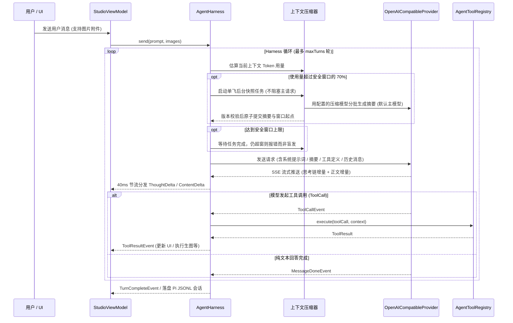
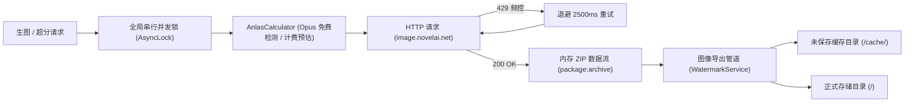
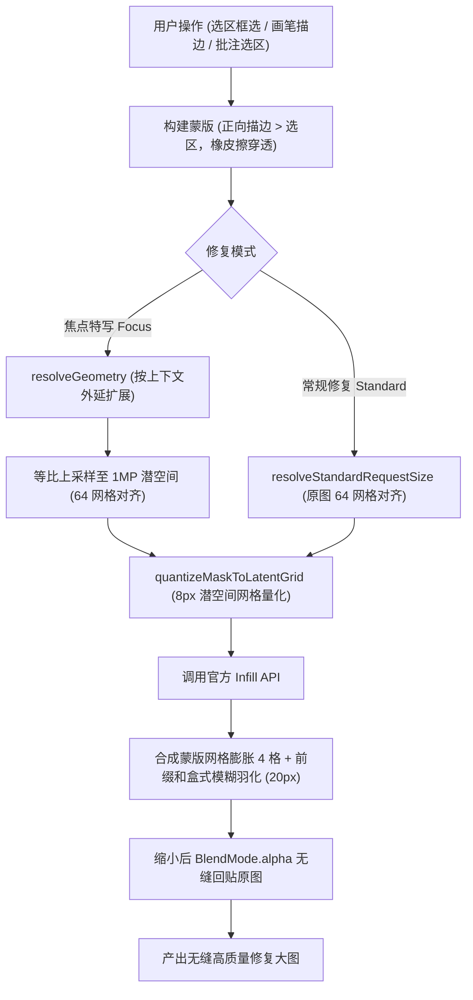
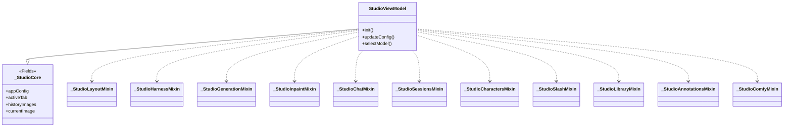
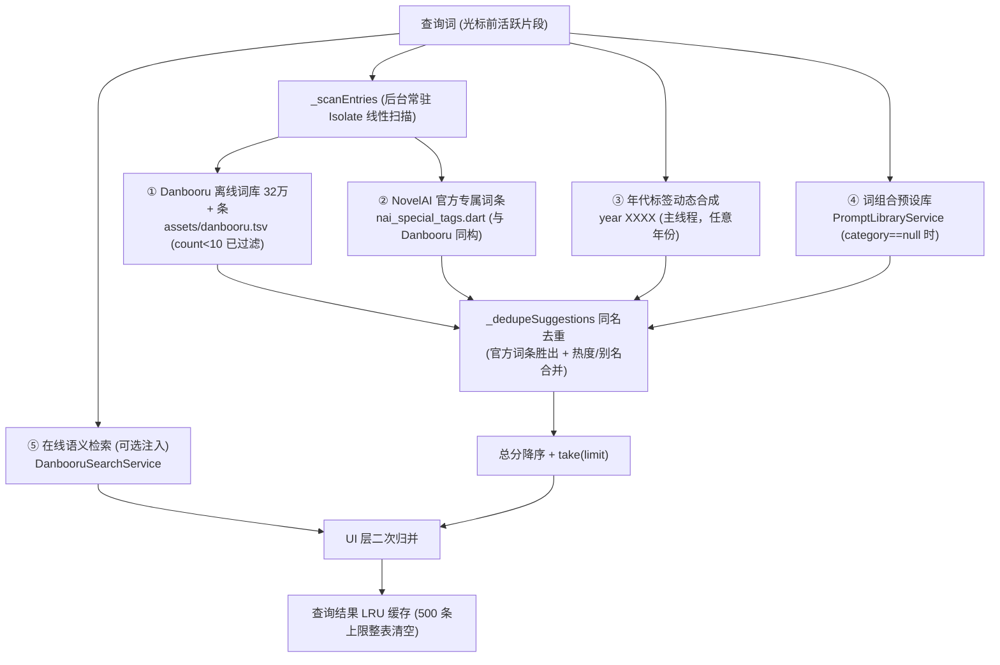
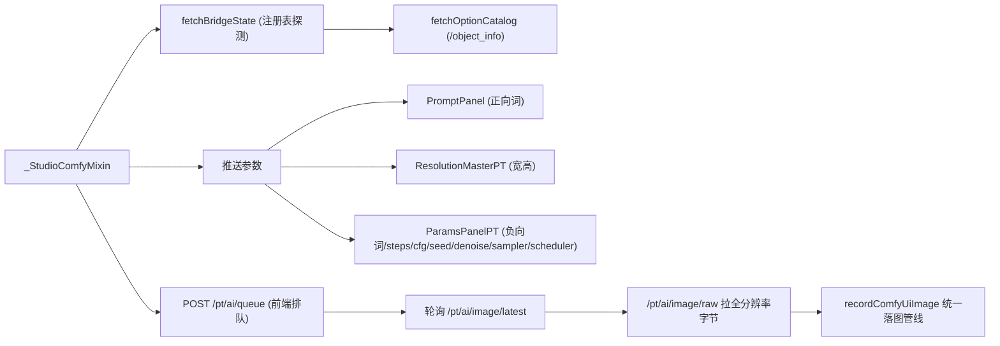

# NovelAI Harness — 系统架构设计与技术文档

本文档详细记录 **NovelAI Harness** 的系统架构设计、工程分层、模块职责划分与核心业务管线设计，作为系统结构与设计的单一事实源。

---

## 1. 系统分层架构 (Layered Architecture)

项目采用标准的清晰分层架构，分为 **Core Harness**、**Data Layer** 与 **UI Presentation Layer**，遵循高内聚、低耦合原则：

```mermaid
graph TD
    subgraph UI ["表现层 (UI Layer - MVVM)"]
        StudioView["StudioView (三卡片自适应工作台)"]
        Sidebar["StudioSidebar (侧栏导航)"]
        ParamPage["Parameters / Prompts / Inpaint / Library"]
        CanvasView["ImageCanvas / InpaintCanvas / BoardView"]
        ChatView["AgentChatCard (对话流 / 思考链 / 附件)"]
        Settings["SettingsDialog (五维设置中枢)"]
        VM["StudioViewModel (状态管理中枢 - 11 个 Mixin 分部组合)"]
    end

    subgraph Core ["核心运行时 (Core Harness Layer)"]
        Harness["AgentHarness (事件驱动多轮调度循环 / 瞬态重试 / 耗尽收尾)"]
        Compaction["Context Compaction (上下文自适应动态压缩)"]
        Providers["LLM Providers (OpenAI 兼容协议 / SSE / 思考解析)"]
        Tools["Agent Tools (生图 / 修复 / 批注 / 词库 / 画板审查)"]
        Skills["Skills System (SKILL.md 渐进式披露)"]
        VisionCodec["VisionImageCodec (最长边 1024 压缩 / MIME 嗅探)"]
    end

    subgraph Data ["数据与服务层 (Data Layer)"]
        NovelAiRepo["NovelAiRepository (存储 / 历史 / 缓存 / 业务管线聚合)"]
        NovelAiSvc["NovelAiService (官方 HTTP 通信 / 并发锁 / ZIP 解包)"]
        InpaintSvc["InpaintService (1MP 潜空间网格超采样 / 量化蒙版 / 无损回贴)"]
        WatermarkSvc["WatermarkService (可见水印 / 智能选位 / DCT 盲水印)"]
        ImageEditSvc["ImageEditService (外部绘图模型 OpenAI 兼容整图重绘)"]
        TagDictSvc["TagDictionaryService (32万+ Danbooru 词库 / Isolate 检索)"]
        PromptAstEng["PromptAstEngine (提示词 AST 分词 / 权重增减 / SD 转换)"]
        LedgerSvc["UsageLedgerService / SessionLogService (账本 / Pi JSONL 会话)"]
        ConfigSvc["ConfigService (配置持久化 / 预设自动同步)"]
    end

    UI --> Core
    UI --> Data
    Core --> Data
```



- **Core Harness Layer (`lib/core/`)**：轻量级 AI Agent 运行时。不依赖 Flutter UI 控件，通过事件流（Event Stream）驱动，负责对话生命周期、瞬态错误退避重试、Token 驱动的自适应上下文压缩、工具注册与执行、以及技能动态加载。
- **Data Layer (`lib/data/`)**：负责外部 API 通信、数据持久化、复杂数学/图像处理与底层服务。包含 NovelAI 协议适配、焦点重绘几何算法、DCT 盲水印管道、32万+ Danbooru 离线字典检索等核心服务。
- **UI Presentation Layer (`lib/ui/`)**：纯声明式 Flutter 界面，严格践行 MVVM 模式。视图（View）只负责布局、用户手势与视觉渲染，所有业务状态与事件分发完全由 `StudioViewModel`（通过 Mixin 分部组合）集中调度。

---

## 2. 目录结构与完整模块清单

```text
Novelai-harness/
├── lib/
│   ├── main.dart                               # 桌面端初始化、窗口托管与应用启动入口
│   │
│   ├── core/                                   # 极简 AI Harness 运行时
│   │   └── harness/
│   │       ├── types.dart                      # 消息、事件流、角色、工具调用与附件数据模型
│   │       ├── agent_harness.dart              # 核心 Agent 调度器 (多轮对话/工具执行/自适应压缩/瞬态重试/耗尽收尾)
│   │       ├── agent_context.dart              # 请求上下文生命周期、回复编号与会话笔记状态
│   │       ├── agent_compaction.dart           # 单飞后台压缩快照、分批摘要与版本校验提交
│   │       ├── context_memory.dart             # 会话笔记/请求侧释放与上下文用量快照
│   │       ├── session_recorder.dart           # 会话记录器抽象接口 (Pi 格式落盘钩子)
│   │       ├── presets/
│   │       │   └── agent_preset.dart           # Agent 预设模型 (系统提示词/可用Skills/工具与参数权限白名单)
│   │       ├── providers/
│   │       │   ├── llm_provider.dart           # LLM 提供商通用接口抽象
│   │       │   └── openai_provider.dart        # OpenAI 兼容协议流式实现 (SSE 解析、思考链状态机提取与 Token 统计)
│   │       ├── tools/
│   │       │   ├── agent_tool.dart             # 工具抽象基类、执行上下文与工具注册中心
│   │       │   ├── annotation_tools.dart       # 画板批注五件套工具与覆盖层离屏绘制 (view/add/update/remove/clear)
│   │       │   ├── anysearch_tools.dart       # AnySearch 网络搜索三件套工具 (web_search / get_search_domains / web_extract)
│   │       │   ├── ask_user_tool.dart          # 向用户提出结构化单选/多选/填空问题 (ask_user)
│   │       │   ├── context_memory_tool.dart    # 会话笔记与请求侧释放 (context_memory)
│   │       │   ├── canvas_view_tool.dart       # 画板历史图片查看工具 (view_canvas_image，支持索引与覆盖层)
│   │       │   ├── character_prompt_tools.dart  # 多角色提示词增删改查四件套工具
│   │       │   ├── danbooru_search_tools.dart  # Danbooru 离线/在线语义搜索与 NPMI 画师推荐工具
│   │       │   ├── load_skill_tool.dart        # Pi 标准按需加载专业技能工具 (load_skill)
│   │       │   ├── novelai_tools.dart          # 生图、新版超分、官方标签联想与账号查询工具
│   │       │   ├── novelai_inpaint_tool.dart   # 局部修复与焦点特写工具 (novelai_inpaint / get_inpaint_geometry)
│   │       │   ├── ai_edit_image_tool.dart    # AI 整图编辑工具 (ai_edit_image，外部多模态模型整图重绘)
│   │       │   ├── prompt_library_tools.dart   # 词组合预设库增删改查与预览图设置工具
│   │       │   ├── studio_params_tool.dart     # 工作台生图参数查询与批量同步修改工具
│   │       │   └── vision_image_codec.dart     # 视觉附件压缩 (最长边 1024 等比缩小 PNG) 与 MIME 嗅探
│   │       └── skills/
│   │           └── skills.dart                 # 内置技能库 (V5 自然语言架构师、艺术总监、Danbooru 标签大师)
│   │
│   ├── data/                                   # 数据与服务层
│   │   ├── models/
│   │   │   ├── novelai_models.dart             # 聚合导出 barrel 文件 (保持模块引用解耦)
│   │   │   ├── anysearch_models.dart           # AnySearch 协议实体 (搜索结果/子域目录/正文提取/异常)
│   │   │   ├── image_palette.dart              # 图片主色盘模型 (ImagePalette/PaletteColor) 与种子色文本互转
│   │   │   ├── inpaint_models.dart             # 局部修复与焦点特写模型 (InpaintMode/Geometry/BrushStroke/Params)
│   │   │   ├── nai_catalog.dart                # NaiModel/采样器/噪声调度/分辨率预设枚举 (含 inpaintModelId)
│   │   │   ├── nai_character_prompt.dart       # 多角色提示词模型、位置布局与坐标量化
│   │   │   ├── nai_generation_params.dart      # 生图参数实体与官方 Payload 构建 (含 toInfillApiPayload)
│   │   │   ├── nai_image_result.dart           # 图片生成结果、流式进度帧与导出标记 (含角标文案)
│   │   │   ├── nai_account_info.dart           # 账号等级、V5 体力池余量与官方 Tag 联想模型
│   │   │   ├── nai_prompt_presets.dart         # 质量词/UC 预设与提示词文本后处理
│   │   │   ├── prompt_library_models.dart     # 词组合预设分类常量与 PromptComboEntry 实体
│   │   │   ├── llm_models.dart                # LLM 供应商、模型卡片、思考参数格式与图像输出能力
│   │   │   ├── tag_models.dart                 # Danbooru 标签分类、联想条目与 NovelAI Token 结构
│   │   │   ├── nai_special_tags.dart           # NovelAI 官方专属标签事实源 (画质/美学/复杂度/数据集/透明通道/改名/其他 + 年代样例)
│   │   │   ├── image_annotation.dart           # 图像批注模型 (rect 选区/point 图钉/global，归一化坐标+调色板)
│   │   │   ├── canvas_board_models.dart        # 自由大画布节点模型 (图片卡/便利贴/连线/视口矩阵，含 JSON 序列化)
│   │   │   ├── image_metadata_models.dart      # 图像元数据模型与水印配置实体 (WatermarkConfig)
│   │   │   └── comfyui_models.dart            # ComfyUI 模式实体 (Bridge 状态快照/参数补丁/实时选项清单/图片条目)
│   │   ├── services/
│   │   │   ├── novelai_service.dart            # NovelAI 官方 HTTP 通信、并发锁与纯内存 ZIP 解包
│   │   │   ├── anysearch_service.dart           # AnySearch 官方 REST 客户端 (搜索/子域目录/正文提取，信封解析与 Bearer/匿名双模式)
│   │   │   ├── anlas_calculator.dart           # 现代 Anlas 消耗计算单一事实源 (Opus 免费档/分档超分计费)
│   │   │   ├── inpaint_service.dart            # 焦点特写几何计算 (1MP 潜空间超采样/64 步长)、量化蒙版与无损回贴
│   │   │   ├── watermark_service.dart          # 图像导出管道单一事实源 (可见水印/自动对比度/智能选位/Koch-Zhao DCT 盲水印)
│   │   │   ├── image_save_path_service.dart    # 图片命名宏、生成快照、相对目录模板校验与安全净化
│   │   │   ├── image_file_store.dart           # 递归目录、独占占位、防覆盖编号与配对原图副本写入
│   │   │   ├── image_storage_directory_service.dart # 安卓存储目录读写探测、旧配置修复与应用文档目录回退
│   │   │   ├── image_edit_service.dart         # 外部绘图模型整图编辑服务 (OpenAI 兼容 /chat/completions 传图返图)
│   │   │   ├── comfyui_service.dart            # ComfyUI PromptToolkit AI Bridge 客户端 (注册表探测/参数下发/采样器选项实时拉取)
│   │   │   ├── image_metadata_service.dart     # PNG Chunks 与 Alpha LSB 隐写读取、元数据脱敏抹除与注入
│   │   │   ├── palette_service.dart            # 图片主色盘提取 (MD3 Celebi 量化+Score 打分，后台 Isolate，LRU 缓存)
│   │   │   ├── tag_dictionary_service.dart     # 32万+ Danbooru 离线词库检索、官方专属词同构合并、年代标签动态合成、多模态反查与缓存服务 (后台 Isolate)
│   │   │   ├── prompt_ast_engine.dart          # NovelAI 提示词 AST 分词、权重增减、注释禁用与 SD 语法转换引擎
│   │   │   ├── prompt_token_counter_service.dart # 提示词 Token 计数单一事实源 (T5/Qwen 真分词、V3 CLIP 启发式、黄/红双档阈值)
│   │   │   ├── tokenizers/                     # 分词器实现 (T5 SentencePiece / Qwen3.5 BPE，词表资产 assets/tokenizers/)
│   │   │   ├── prompt_library_service.dart     # 词组合预设库本地持久化、检索与 JSON 导入导出
│   │   │   ├── config_service.dart             # 本地配置与 ~/.pi/agent/novelai.json 自动识别与内置预设同步
│   │   │   ├── session_log_service.dart        # Pi 官方标准 JSONL 格式会话记录与多分支恢复
│   │   │   ├── usage_ledger_service.dart       # Token 增量账本记录、去重与多维聚合统计
│   │   │   ├── llm_model_fetcher.dart          # 在线拉取远程 LLM 模型列表与能力元数据自动解析
│   │   │   ├── models_dev_catalog.dart         # models.dev 在线模型能力目录拉取与模糊匹配
│   │   │   └── window_state_service.dart       # 桌面端窗口尺寸、坐标与最大化状态监听与防抖持久化
│   │   └── repositories/
│   │       └── novelai_repository.dart         # 图片落盘存储、历史索引、自动保存缓存管理与生成管线聚合
│   │
│   └── ui/                                     # 表现层 (Flutter Widgets & MVVM)
│       ├── core/
│       │   ├── theme/
│       │   │   ├── app_theme.dart              # 工作台主题体系与 Notion 风格调色板 (支持 MD3 种子注入强调色)
│       │   │   ├── app_colors_extension.dart    # 语义色彩设计令牌 ThemeExtension (可被 MD3 令牌覆盖强调色族)
│       │   │   ├── app_accent_controller.dart   # 主题强调色全局单一事实源 (默认蓝/跟随图片/手动种子 + MD3 方案)
│       │   │   ├── md3_accent.dart              # MD3 DynamicScheme 取色令牌 (8 种方案，Dislike 修正+tonal palette 映射)
│       │   │   └── theme_mode_controller.dart   # 主题模式控制器 (system/light/dark → MaterialApp.themeMode)
│       │   └── widgets/
│       │       ├── resizable_split_view.dart   # 可自由拖动分割线的三栏自适应布局容器
│       │       ├── custom_title_bar.dart       # 顶部沉浸式自定义标题栏 (窗口拖拽与最小化/最大化/关闭)
│       │       ├── context_menu.dart           # Notion 风格右键菜单 (图标、快捷键与分隔线)
│       │       ├── app_color_picker_dialog.dart   # 通用 HSV 取色器弹窗 (渐变滑杆/预设色板/十六进制输入)
│       │   └── smooth_scroll_controller.dart # 平滑滚轮控制器 (重写 pointerScroll 为 160ms 平滑滑动)
│       └── features/
│           ├── settings/                       # 全局配置管理中枢
│           │   ├── views/
│           │   │   └── settings_dialog.dart    # 全局设置弹窗壳 (五栏导航 + IndexedStack 装配)
│           │   └── widgets/
│           │       ├── settings_shared.dart    # 设置域共享件 (卡片/分组标题/操作钮/密钥框/下拉菜单)
│           │       ├── general_settings_tab.dart # 常规页：服务凭证、存储目录、自动保存与免点保护开关
│           │       ├── image_save_template_settings.dart # 图片路径模板表单 (宏插入/示例/预览/校验提示)
│           │       ├── models_settings_tab.dart # 模型页：LLM 供应商管理、模型卡片、在线拉取与 AI 绘图模型配置
│           │       ├── presets_settings_tab.dart # 预设页：预设 CRUD、系统提示词、可用技能与工具权限白名单
│           │       ├── defaults_settings_tab.dart # 默认页：出厂默认生图参数与 Agent 轮数限制
│           │       ├── bill_settings_tab.dart  # 账单页：Token 用量多维账本与明细表格
│           │       ├── model_card.dart         # 模型小卡片 (选中态/能力胶囊/参数配置)
│           │       ├── model_profile_dialog.dart # 单模型档案弹窗 (上下文长度/思考格式/图像输出能力配置)
│           │       ├── skill_card.dart          # 技能卡片 (启用开关/导出/编辑)
│           │       ├── skill_editor_dialog.dart  # 自定义技能编辑弹窗 (SKILL.md 导入导出)
│           │       ├── tool_card.dart           # 工具卡片 (启用开关/Schema 查看)
│           │       └── tool_editor_dialog.dart  # 自定义模板工具编辑弹窗
│           └── studio/                         # 核心工作台功能区
│               ├── view_models/                # Studio 状态管理中枢 (Mixin 分部架构)
│               │   ├── studio_view_model.dart  # 状态管理中枢：核心状态 Mixin + ViewModel 主体初始化与桥接
│               │   ├── studio_vm_layout.dart    # 布局分部：三栏分割线拖拽防抖落盘与侧栏页签切换
│               │   ├── studio_vm_harness.dart   # Harness 分部：工具装配/LLM切换/思考强度切换/预设与技能管理
│               │   ├── studio_vm_generation.dart # 生图分部：生图/新版超分/实时预览/体力池与统一落图管线
│               │   ├── studio_vm_inpaint.dart   # 修复分部：工具切换/描边增删/批注转修复选区与执行流水线
│               │   ├── studio_vm_chat.dart      # 对话分部：多轮对话/图片附件/ask_user提问/付费确认/通知节流
│               │   ├── studio_vm_sessions.dart  # 会话分部：会话切换/新建/重命名/删除与消息树回溯
│               │   ├── studio_vm_characters.dart # 角色分部：多角色提示词 CRUD 与画板定位同步
│               │   ├── studio_vm_slash.dart     # 斜杠分部：斜杠指令分发与参数解析
│               │   ├── studio_vm_library.dart  # 词库分部：词组合预设库检索/增删改/导入导出与一键应用
│               │   ├── studio_vm_annotations.dart # 批注分部：自由大画布节点/便利贴 CRUD 与批注持久化同步
│               │   ├── studio_vm_comfyui.dart  # ComfyUI 分部：Bridge 连接探测/选项清单拉取/参数推送/排队轮询与统一落图
│               │   ├── chat_checkpoints.dart   # 消息树分支检查点 (回溯视图数据模型)
│               │   ├── param_snapshot_journal.dart # 生图参数快照日志 (记录 Agent 参数修改差异)
│               │   └── slash_command_catalog.dart # 内置斜杠指令目录单一事实源 (自动补全与 /help 共享)
│               ├── views/
│               │   └── studio_view.dart        # 工作台主界面：三卡片自适应组装与快捷键监听
│               └── widgets/
│                   ├── studio_sidebar.dart      # 最左侧图标导航栏 (参数/提示词/修复/词库四页切换)
│                   ├── parameter_card.dart      # 左侧面板薄壳容器：四页 IndexedStack + 底部生成坞
│                   ├── parameters_page.dart     # 页面一：模型选择/分辨率/采样算法/CFG/高级选项/水印面板
│                   ├── prompts_page.dart        # 页面二：正负提示词双模式与提示词扩展甲板
│                   ├── inpaint_page.dart        # 页面三：Notion 极简修复卡片 (模式切换/几何信息/外延与噪声滑块)
│                   ├── prompt_library_view.dart # 页面四：全屏词组合预设库画廊 (分类导航/卡片网格/导入导出)
│                   ├── inpaint_canvas_overlay.dart # 独立单图修复画板 (contain 居中对齐/框选/画笔/橡皮/上下文虚线框)
│                   ├── prompt_extension_deck.dart # 提示词扩展甲板 (多角色 ↔ 固定词缀左右滑动切换)
│                   ├── character_card_item.dart # 单角色编辑卡片 (角色名/启停/位置胶囊/正负词拖拽调高)
│                   ├── character_position_canvas_view.dart # 画板角色位置交互层 (连续锚点拖拽/5x5 网格/悬浮控制)
│                   ├── chat_image_attachment.dart  # 用户对话图片附件 (归一化 ≤1024px PNG 缩略预览)
│                   ├── prompt_editor_card.dart  # 通用提示词编辑卡片 (只读提示/输入框/工具条/快捷操作)
│                   ├── prompt_edit_actions.dart  # 光标标签操作共享工具 (权重增减/禁用/格式化/快捷键共用)
│                   ├── prompt_resize_handle.dart # 高度拖拽手柄 + ResizableTextField 自适应输入框
│                   ├── prompt_combo_card.dart   # 词组合预设画廊卡片 (预览缩略图/追加覆盖/右键菜单)
│                   ├── prompt_combo_edit_dialog.dart # 词组合新建与编辑弹窗 (左侧预览图/右侧表单)
│                   ├── rich_prompt_text_controller.dart # NovelAI 富文本语法高亮控制器 (权重/记号淡显/分类着色)
│                   ├── tag_autocomplete_overlay.dart # 标签自动补全悬浮锚点 (光标跟随/键盘导航/防抖检索)
│                   ├── tag_autocomplete_card.dart   # Danbooru 浮动补全建议卡片 (分类色彩/中英双语/热度计数)
│                   ├── tag_suggestion_tile.dart  # 标签分类胶囊与热度计数展示小组件
│                   ├── tag_browser_dialog.dart  # Danbooru 标签灵感库弹窗 (精选分类与高频词速查)
│                   ├── tag_inspiration_presets.dart # 标签灵感库数据源 (官方专属分组置顶 + 内置精选分类)
│                   ├── fixed_affixes_panel.dart # 固定词缀编辑面板 (前缀/后缀独立拖拽调高)
│                   ├── generate_dock.dart       # 底部操作坞：账号等级/体力池状态/免点标识 + 动态主生成按钮
│                   ├── resolution_pad_picker.dart # 2D 可视化分辨率画板与常用比例预设
│                   ├── watermark_pad_picker.dart # 水印设置面板 (可见水印/自动对比度/智能选位/盲水印强度与载荷)
│                   ├── watermark_position_overlay.dart # 水印 2D 交互画板 (拖拽选位/缩放手柄/滚轮微调)
│                   ├── canvas_position_floating_controls.dart # 角色与水印悬浮控制栏 + 滚轮循环切换
│                   ├── metadata_reader_dialog.dart # Notion 极简元数据解析弹窗 (参数网格/角色卡/Raw/一键回填)
│                   ├── palette_inspector_dialog.dart # 图片调色盘弹窗 (主色网格/MD3 方案亮暗预览/一键设主题强调色)
│                   ├── image_canvas_card.dart  # 中间面板：大图交互画板主壳 (支持拖入带元数据图片自动识别)
│                   ├── image_stream_view.dart  # 流式生图渲染视图与当前展示大图
│                   ├── image_canvas_actions.dart # 画板右上浮动工具条 (复制脱敏/复制原图/新版超分/打开目录)
│                   ├── canvas_history_sidebar.dart # 画板历史侧栏 (缩略图轮播/多重角标/右键管理)
│                   ├── canvas_overlays.dart     # 画板悬浮覆盖层 (新图到达横幅/未读状态)
│                   ├── freeform_annotation_board.dart # 自由大画布主壳 (无限漫游缩放/节点摆放/连线交互)
│                   ├── board_toolbar.dart      # 大画布顶部浮动工具坞 (漫游/框选/图钉/便签/参考图/适应视口)
│                   ├── board_image_card.dart   # 图片节点卡片 (顶栏拖拽/连线端口/圈选批注/手柄缩放)
│                   ├── board_note_card.dart    # 便利贴节点卡片 (顶栏拖拽/连线端口/Markdown 文本编辑)
│                   ├── board_wire_painter.dart  # 大画布连线与背景网格分层绘制器 + 落点命中测试
│                   ├── annotation_history_strip.dart # 批注模式历史侧栏 (拖拽历史图片作为参考图进画布)
│                   ├── image_lightbox.dart     # 全屏沉浸式灯箱看图组件
│                   ├── agent_chat_card.dart    # 右侧面板：AI 对话主壳 (对话/回溯/会话三视图切换)
│                   ├── agent_chat_messages.dart # 对话消息平铺渲染块 (user/assistant/toolCall/toolResult)
│                   ├── agent_chat_blocks.dart  # 折叠块、思考链块与工具结果平铺组件
│                   ├── agent_chat_input_bar.dart # 底部模型/思考强度切换选择器与多模态输入栏
│                   ├── slash_command_overlay.dart # 斜杠指令建议面板与自动补全悬浮窗
│                   ├── agent_rewind_view.dart   # 历史时刻回溯视图 (双击 ESC 唤出)
│                   ├── agent_session_list_view.dart # 会话抽屉列表视图 (管理多会话)
│                   ├── inline_agent_question_card.dart # ask_user 结构化提问内嵌卡片
│                   ├── pill_widgets.dart       # 胶囊选择器通用组件 (PillDropdown / ToggleChip)
│                   ├── editable_slider.dart    # 精准数值微调滑块 (整型与浮点统一封装)
│                   └── studio_shared.dart       # 共享原子组件 (分组标题/清空按钮/Token 状态条)
```

---

## 3. 核心子系统架构与数据流

### 3.1 AI Harness 运行时架构与自适应压缩

`AgentHarness` 是极简 Agent 调度的核心，基于流式事件驱动（Event Stream）：



- **上下文用量与后台压缩**：
  - 聊天输入栏显示当前请求上下文估算、窗口、占比、笔记数量与后台状态，不与累计账单混淆。有效响应的 `usage.total` 为用量锚点，后续消息增量估算；不重复加入系统开销。压缩、模型切换或遗忘后丢弃旧锚点，重新计入系统、工具 Schema、摘要、笔记及折叠图片；非 ASCII 文本保守按每字符一 Token 估算。
  - `agent_compaction.dart`：安全窗口为模型窗口减预留（预留最多占窗口 1/4）；默认在其 70% 启动单飞后台快照压缩，主回复继续运行，临近上限才等待。若仍超窗则明确报错。近期预算默认 20,000，且最多占安全窗口 1/3；切点不拆散工具调用与结果。
  - 设置 → 默认 → 上下文管理可独立开关自动/后台压缩，选择已有供应商及模型，或跟随主模型（选择失效时也回退主模型）。仍复用 OpenAI 兼容协议及供应商思考格式，不引入其他原生协议；压缩用量独立计入实际压缩模型的账单。
  - 小窗口压缩模型采用分批迭代摘要，不再直接截掉超长历史。流闲置超时、错误、空摘要或无压缩收益时保留原上下文。会话切换、回溯、记忆修改、模型配置变化与销毁均使旧快照失效，晚到结果不得跨会话提交。
- **回复编号与会话笔记**：
  - `AgentMessage.replyNumber` 为稳定回复编号，界面显示 `#N`，模型请求携带 `[回复 #N]`，原文不被改写。新回复递增，回溯后不复用已分配编号；旧会话按历史顺序补号。
  - `context_memory.dart` / `agent_context.dart` 管理本会话笔记和请求侧释放状态；`context_memory` 工具支持 `list`、`add_note`、`delete_note`、`forget_reply`、`read_reply`，遵守预设白名单。笔记最多 64 条，每条 2,000 字符；回复列表分页 50 条，原文分页 8,000 字符。所有写操作同时接受单数与复数参数（`text`/`texts`、`id`/`ids`），一次调用即可批量保存、删除或释放复数条目；批量释放逐项处理，不存在的编号只作部分失败提示，全部失败才按错误返回。
  - **批量工具参数约定**：凡以 ID/编号定位多条目集合的 Agent 工具均同时提供单数与复数参数（`id`/`ids`、`annotation`/`annotations`、`title`/`entries`、`skill_name`/`skill_names`、`url`/`urls`），新增与修改同理（`characters`、`updates`）。批量写入前先整体校验规格，再一次性落盘（批注批量新增只写盘一次），部分失败只作提示、全量失败才报错，避免模型为清理复数条目反复往返调用。
  - 释放旧回复时同时省略其工具结果，以固定占位保留编号；原始用户要求不删除，当前轮回复及已进入摘要的回复不能单独释放。必要信息可先存为笔记，之后仍可按编号读取原文；笔记仅为参考数据，不覆盖系统规则。
  - `SessionLogService` 在 JSONL 消息中保留应用消息 ID 和编号，以同目录 `.jsonl.context.json` 原子写入摘要、窗口、笔记、释放集合及编号高水位。恢复先校验消息 ID 前缀，拒绝过期分支检查点；切换/新建会话隔离记忆，删除会话同时删除检查点。原始消息在 UI 与磁盘 JSONL 中**完整保留**。
- **视觉附件单次展示与 1024 像素降采样**：
  - 视觉模型在多轮对话中如果不断重新读取旧大图，会导致上下文迅速爆满并破坏 Prompt Cache。
  - 系统引入 `imageEpoch` 机制：**图片只给模型看一次**。旧轮次历史图片自动折叠为固定占位文本，仅当前轮新增附件与画板审查结果发送图片数据；
  - `VisionImageCodec` 统一将视觉图片等比缩放至最长边 ≤ 1024px 并转码为 PNG，显著降低多模态 Token 消耗；模型若需查看微观细节，可显式指定 `full_resolution: true` 请求未压缩原图。

---

### 3.2 NovelAI 服务架构与点数保护机制

所有与 NovelAI 官方的交互严格由 `NovelAiService` 与 `NovelAiRepository` 统一封装管理：



- **全局并发锁 (`AsyncLock`)**：所有发送至官方端点的绘图（`/ai/generate-image`）与新版超分（`/ai/upscale`）请求必须通过 `AsyncLock.runExclusive()` 执行，确保全局并发恒为 1，杜绝并发封号或频控惩罚。
- **429 速率限制退避**：遭遇 HTTP 429 时，内部自动退避 2500ms 并执行单次安全重试。
- **内存 ZIP 解包**：完全基于纯内存字节解压，无须落盘临时中间文件。
- **Opus 免点数保护与 Anlas 计费算法 (`AnlasCalculator`)**：
  - 现代全系计费公式：`ceil(2.951823174884865e-6 × 像素数 + 5.753298233447344e-7 × 像素数 × 步数) × 模型倍率`；
  - 严谨的 Opus 免费档判定：`像素 ≤ 1,048,576` 且 `采样步数 ≤ 28` 且 `nSamples == 1`；同时监控 V5 专属体力池透支状态。
- **新版超分协议 (2026-08 官方换代)**：
  - 切换至 `https://image.novelai.net/ai/upscale` Multipart 表单端点；新超分模型固定倍率输出，不再传递 `scale` 参数；输出物理尺寸直接从返回图像字节解码获取。

---

### 3.3 局部修复与焦点特写管线 (Inpaint Pipeline)

局部修复体系彻底将常规修复与焦点特写在几何、潜空间与渲染层面进行了无缝统一：



- **潜空间量化与无缝回贴**：
  - 焦点模式将局部重绘区域外延 padding 后，等比拉伸至 1MP 潜空间以激发模型最佳细节表现；
  - 蒙版上传前严格按 8px 潜空间网格（Latent Grid）进行中心采样与量化，与官方服务端计算网格完全对齐；
  - 生成结果返回后，回贴算法对量化蒙版执行 4 格膨胀，并采用 \(O(1)\) 时间复杂度的双重盒式模糊进行平滑羽化，彻底消除回贴硬接缝与色环。
- **批注与修复智能联动**：
  - 允许通过 `annotation_id` 将画板上的矩形选区或图钉锚点一键带入修复模式；
  - 严格遵循**区域与提示词解耦**原则：批注仅提供修复几何区域，提示词默认复用当前工作台提示词，严禁盲目复制用户在批注便签中记录的修改抱怨文本。

---

### 3.4 图像导出管道与水印系统 (Watermark & Export Pipeline)

所有落盘存储或剪贴板导出的图片，均流经 `WatermarkService.processExportImage` 单一管道：

$$\text{原始原图} \xrightarrow{\text{步骤 1}} \text{可见水印合成} \xrightarrow{\text{步骤 2}} \text{元数据脱敏/嵌入} \xrightarrow{\text{步骤 3}} \text{Koch-Zhao DCT 盲水印嵌入} \xrightarrow{} \text{最终导出图}$$

1. **可见水印合成**：支持 2D 归一化位置、缩放与透明度；
   - **自动对比度 (`autoContrast`)**：智能采样水印覆盖区域背景亮度，自适应调整水印亮暗色彩；
   - **智能选位 (`autoPosition`)**：下采样后计算图像 Sobel 梯度能量积分图，通过滑窗迅速寻找画面细节最少、视觉干扰最低的平坦区域放置水印。
2. **元数据处理**：根据设置保留、更新或彻底脱敏抹除 PNG 的 `Title`/`Software`/`Comment` 等私有文本块。
3. **Koch-Zhao DCT 盲水印隐写**：
   - 采用 DCT 中频系数对能量差隐写算法，通过伪随机序列打乱，将载荷（魔数 + 长度 + CRC16 + 文本）循环冗余嵌入图像 8×8 频域块；
   - 提取时通过多数投票机制还原文本，具备优异的抗轻微重编码与抗截断鲁棒性。

---

### 3.4.1 图片命名宏与目录归档

- **设置入口**：设置 → 常规 → 图片命名模板。`AppConfig.imageSaveTemplate` 以 `novelai_image_save_template` 持久化；空串使用 `{prefix}_{date}_{time}_{seed}`。模板相对于本地存储目录，`/` 或反斜杠用于分目录，文件末尾自动补 `.png`（已写 `.png` 时不重复）。修改模板只影响之后的导出，不搬动已有文件。
- **宏清单**：`{prefix}` 来源前缀、`{type}` (`generate` / `inpaint` / `ai_edit` / `upscale` / `comfyui`)、`{date}` (`yyyyMMdd`)、`{time}` (`HHmmss`)、`{year}` / `{month}` / `{day}`、`{seed}`、`{model}`、`{width}` / `{height}` / `{resolution}`、`{steps}` / `{cfg}` / `{sampler}` / `{scheduler}`、`{prompt}`（基础提示词，会暴露在文件名中）。支持 `{date:yyyy-MM-dd}` / `{date:HHmmss_SSS}` 等格式；格式字符仅允许 `y M d H m s S` 与点、下划线、空格、短横线，不允许在格式内部生成目录。
- **示例**：`{date:yyyy-MM}/{model}/{seed}_{time}` → `2026-09/nai-diffusion-5-full/42_030405.png`；`{type}/{date:yyyy-MM-dd}/{resolution}_{seed}` 按来源与日期分目录。
- **命名单一事实源**：`ImageSavePathService` 负责校验、宏展开与净化；`GeneralSettingsDraft` 生成预览和校验状态，表单仅展示。宏读取成品的参数、种子、生成时间快照，隔天手动保存仍使用图片原日期。`NaiGeneratedImage.outputModel` 为外部编辑模型保留真实 ID；ComfyUI Bridge 不提供 checkpoint 名时固定为 `comfyui`，超分继承源图模型。ComfyUI 采样参数宏是工作台快照，不保证等于未下发字段的工作流实际参数。
- **覆盖范围**：NovelAI 普通/流式生图、普通/流式修复、AI 编辑、超分、ComfyUI 与手动保存共用 `_persistImageFiles`。ComfyUI 成品也落原图缓存并按自动保存开关导出，尺寸取返回字节的实际解码值。Agent 工具同步透传模板及全局水印/脱敏/原图保留设置。
- **安全与冲突**：不允许绝对路径、`..`、空目录或占用根下的 `cache` / `board_refs`；宏值先净化，提示词中的斜杠不会生成目录。Windows 设备名、尾随点空格、控制字符被净化，Unicode 按 UTF-8 字节截短；模板最长 512 字符、最多 7 层子目录，展开相对路径预算 180 字节（冲突编号另计）。无效模板在设置中阻止保存，外部损坏配置在导出时回退默认模板。
- **无覆盖落盘**：`ImageFileStore` 检查子目录链接逃逸，以 `File.createSync(exclusive: true)` 占位，已有同名文件/目录自动递增 `_2`、`_3`。成品与 `_raw` 副本作为配对路径共同选取编号，写入异常清理本次占位，不触碰旧文件。
- **缓存隔离**：`cache/` 原图仍使用内部平铺命名，且同样不覆盖；命名模板不改变历史索引、画布布局或缓存清理语义。正式导出失败时保留缓存和未保存状态，支持修改目录或模板后重试。导出处理顺序仍为可见水印 → 元数据 → 盲水印。

---

### 3.4.2 安卓图片持久化与系统导出

- **目录能力分离**：安卓 `FilePicker.getDirectoryPath()` 返回的公共目录即使存在、已获 SAF 授权，也不等于 `dart:io` 能写 PNG、JSON 与子目录。`ImageStorageDirectoryService` 在启动及目录配置变更时验证普通绝对路径，通过独占临时子目录与 JSON 读写探针检查持久化能力；仅清理自身探针，不修改已有文件。
- **旧配置修复**：保留仍可读写的旧目录；空串、相对路径、`content://` URI 或不可写目录回退 `getApplicationDocumentsDirectory()/NovelAI_Output`，修正后写回 `novelai_save_dir`。安卓应用目录也失败时显式抛错，不再退成空串导致仅存内存；桌面自定义目录语义不变。
- **界面入口**：安卓设置页目录只读，不再提供公共目录选择器。内部图片缓存、正式导出、历史索引与画布沿用同一仓储和持久目录，自动保存关闭时也可重启恢复未保存图片。应用私有图片会随卸载/清除应用数据删除，设置页明确提示。
- **MediaStore 公共图库导出 (2026-12)**：安卓成品导出不再依赖 SAF 单文件写入，改经 `MainActivity` 原生平台通道 (`novelai_harness/media_store`) 写入系统媒体库：
  - **手动导出** (长按图片 → 保存到文件夹)：优先写入用户自选 SAF 导出目录 (含命名模板子目录)；未选择或授权失效时回退 `MediaStore.Images` `RELATIVE_PATH` 写入公共 `Pictures/NovelAI/<命名模板子目录>`，再失败回退 `FilePicker.saveFile(bytes:)` SAF 单文件导出 (iOS 维持 SAF 不变)。
  - **自选导出目录 (2026-12)**：设置页 → 常规 → 导出文件夹 (仅 Android) 提供 SAF 目录选择器 (`ACTION_OPEN_DOCUMENT_TREE`)，选中后原生侧 `takePersistableUriPermission` 持久化读写授权 (重启仍生效)；`AppConfig.androidExportTreeUri` 落盘 content:// 树 URI。成品经 `DocumentsContract.createDocument` 逐段写入 (子目录按需创建，同名自动改名不覆盖)；写入前原生校验持久授权 (`persistedUriPermissions`)，失效则回退默认图库。设置页启动时经 `getTreeInfo` 校验授权与显示名，被撤销则清空展示。
  - **自动保存联动**：`AppConfig.androidGalleryExport` (默认开，设置页 → 常规 → 同步导出到系统图库) 开启时，`StudioViewModel._syncGalleryExportHook` 向 `NovelAiRepository.galleryExportFn` 注入导出钩子：自选目录存在时写入该目录树，否则写系统图库 `Pictures/NovelAI/<模板子目录>`；钩子抛错被仓储吞掉不阻塞落图，未保存缓存与关闭开关时不触发。手动导出与自动联动均复用 `MediaStoreService` (Dart 侧封装，含平台判定与通道注入，`MediaStoreException` 携带原生错误码)。
  - **剪贴板复制**：安卓 `Pasteboard` 插件不支持写入，复制图像改走同通道 `copyImage` —— 字节写入应用缓存 `clipboard/` 子目录 (仅保留最近 8 个)，经 `FileProvider` 转为 `content://` URI 后 `ClipData.newUri` 放入系统剪贴板；完整 PNG 字节含元数据，聊天/编辑类应用可直接粘贴。清单注册 `WRITE_EXTERNAL_STORAGE` (maxSdk 28) 与 FileProvider paths。
  - **回归覆盖**：`media_store_export_test.dart` 覆盖通道参数透传、异常映射 (`PERMISSION_DENIED` 判定)、空字节/非安卓拒绝、仓储钩子的成品字节一致性、抛错不阻塞主流程与未保存不触发；Kotlin 侧经 `:app:compileDebugKotlin` 编译门禁。
- **回归覆盖**：`android_image_persistence_test.dart` 覆盖目录回退、保留旧数据、探针清理、配置修复落盘、运行时变更以及自动/手动保存下新 ViewModel 重启恢复和懒加载原图；所有绘图请求均 Mock。

---

### 3.5 自由大画布与动态连线架构 (Freeform Canvas Board)

自由大画布支持无限漫游、多图参考、矩形/图钉批注与便利贴动态连线：

- **局部覆盖重绘架构 (`BoardLiveOverrides`)**：
  - 卡片拖拽、选区调节与手柄拉伸期间，完全通过 `ValueNotifier<BoardLiveOverrides>` 局部驱动，连线层 `BoardWirePainter` 仅重绘连线 CustomPaint，绝不在拖拽过程中频繁触发整个工作台的 `notifyListeners()`，确保 60fps 满帧丝滑交互。
- **分层绘制与命中测试**：
  - 背景网格位于卡片底层（`painter`），动态连线位于卡片顶层（`foregroundPainter`），节点卡片位于中间；
  - 连线端口支持一对多关系，参考图与便利贴连线自动进行锚点边缘回缩，避免遮挡编号徽章。

---

### 3.6 StudioViewModel MVVM 分部组合架构

为了避免单一 ViewModel 文件膨胀为千行上帝类，`StudioViewModel` 采用 Dart `part` 与 `Mixin` 机制解耦组合：



- **`_StudioCore`**：统一定义所有私有核心状态字段与数据访问契约；
- **各领域 Mixin**：将布局、Harness 调度、生图流水线、修复处理、对话与流式节流、会话分支、角色管理、斜杠指令、词库、大画布批注、ComfyUI 桥接等逻辑高内聚拆分到各个独立分部中，保持各业务职责极其明确。

---

### 3.6.1 工作台参数持久化

- **完整快照**：`ConfigService.saveStudioParameters` 将 `NaiGenerationParams.toJson()` 与可复用修复设置合写到 SharedPreferences 的 `novelai_studio_parameters`。覆盖模型、宽高、Prompt Guidance / CFG、CFG Rescale、步数、采样器、噪声调度、种子数值/模式/时机、张数、质量词开关/档位、UC 档位、透明背景、正负提示词、固定词缀以及角色提示词/坐标/定位模式；修复保存模式、强度、噪声、外延、画笔大小、独立提示词/模型/采样覆盖项及 AI 编辑比例/分辨率。选区、笔迹、蒙版包围盒不保存，也不从损坏或旧快照恢复，避免套用到另一张图。
- **恢复与默认值**：启动优先读完整快照；缺失字段或无快照时兼容旧版提示词/角色/种子散项及设置页默认值。工作台调整不反写默认设置；用户显式修改默认设置时，仅将改动项应用到工作台，不因保存主题等无关设置重置现有参数。损坏 JSON/类型回退，不阻塞启动。
- **保存时机**：`_StudioCore._scheduleParameterSave()` 统一 300ms 防抖，写入按调用顺序串行，防止慢旧快照覆盖新值。UI、Agent、元数据回填、回溯及普通/ComfyUI 生图自动变更种子均沿用此入口。
- **正常退出**：`WindowStateService` 拦截系统关闭请求，标题栏也走同一 `closeWindow()`；通过宿主注入的 `beforeClose` 回调等待 `StudioViewModel.flushPendingSaves()`（参数、待保存布局、全局配置、会话写队列），再保存窗口状态并销毁窗口。重复关闭合并，参数保存失败则保留窗口以便重试。启动尚未恢复本地参数时关闭不写空默认值，也不等待账号网络查询。强制终止进程不属于此保证范围。

---

### 3.7 标签补全多源合并管线 (Tag Suggestion Pipeline)

标签自动补全、标签灵感库、提示词高亮与 Agent 离线标签检索均汇聚到 `TagDictionaryService.search()` 单一漏斗，内部按四个数据源公平打分合并：



- **官方专属词条同构合并**：`nai_special_tags.dart` 按官方文档 (docs.novelai.net/en/image/tags) 分节维护 Quality / Aesthetic / Complexity / Dataset / Alpha / Renamed / Other 七组词条 (含中文释义、模型可用范围、改名标签旧写法别名)，在解析层转成与 Danbooru 同构的 `_DictEntry` 参与**同一次扫描**。因此词条恒定可用：词库未加载、资产缺失或热替换为空时依然能补全官方专属词。
- **等效热度加权 (`_kNaiSpecialBoost = 92`)**：专属词条没有 Danbooru 热度计数 (`postCount = 0`)，若不加权会被任何有热度的同档位词条挤到末尾 (输入 `best` 时 `best quality` 排在 `bestiality` 之后)。按「等效 10 万热度」(`log(1e5) × 8 ≈ 92`) 加权后：胜过冷门 Danbooru 词条，但仍让位于 `long hair` (616 万) 这类超高频词——加权只影响总分，不影响展示计数，短前缀查询的热度排序不被破坏。
- **改名标签别名优先**：官方因 `|` 是提示词混合分隔符而改名的词条 (`tachi-e` → `character image`、`eyepatch bikini` → `square bikini`、`v` → `peace sign` 等)，旧写法走 `aliases`；专属词条的别名匹配**先于**中文释义包含匹配判定，使旧语法以别名档位 (800) 而非中文包含档位 (300) 命中新词条，同时保留 `matchedAlias` 供补全卡展示「别名: tachi-e」。Danbooru 侧打分顺序保持原样不变。
- **年代标签动态合成**：官方 `year XXXX` 可填任意年份，词典无法穷举，故不入静态清单，由主线程按查询前缀实时合成 (当前年份倒序至 1900)；四位完整年份走精确档、部分前缀走前缀档，不越级抬高。`translationOf` / `categoryOf` 对年代标签按需还原，因此提示词高亮无需词条落表。
- **同名去重与字段合并**：`transparent background`、`alpha transparency`、`visual novel cg` 等词条 Danbooru 与官方两侧都存在，去重时保留携带官方分组胶囊 (`NAI·画质` 等) 与模型可用范围说明的专属词条，并合并 Danbooru 侧的热度计数、别名与更高分值。
- **反查表覆盖**：专属词条在词库加载与热替换后写入 `_tagToZh` / `_tagToCat` 并覆盖同名 Danbooru 释义，使 `rich_prompt_text_controller` 的分类着色与中文释义对官方专属词同样生效；服务构造时先行播种，保证词库加载前也能高亮。
- **UI 分组呈现**：标签灵感库 (`tag_inspiration_presets.dart`) 以 `kTagInspirationGroups` 将官方专属词条按文档分节置顶 (`NAI·画质` / `NAI·美学` / … / `NAI·年代`)，其后才是人工维护的通用灵感分类；灵感库无别名胶囊，故改用 `galleryZh` 补齐改名标签的旧写法说明，补全卡则用 `displayZh` 避免与别名胶囊重复。

---

### 3.8 ComfyUI 模式与 AI Bridge 驱动管线 (ComfyUI Mode)

工作台支持把生图后端从 NovelAI 官方接口切换为本地/局域网 ComfyUI，经 PromptToolkit 插件的 AI Bridge (`/pt/ai/*` HTTP 路由) 驱动：



- **采样器与调度器实时获取**：ParamsPanelPT 节点新增 `sampler_name` / `scheduler` 组合 widget (选项实时取自 ComfyUI 采样器注册表 `comfy.samplers.KSampler.SAMPLERS/SCHEDULERS`，自定义节点注册的扩展采样器自动出现)；工作台连接成功后经标准 `/object_info/ParamsPanelPT` 端点拉取可选值 (旧版插件无该字段时回退 `/object_info/KSampler`)，参数页以两栏下拉呈现，首项「跟随工作流」表示不下发该字段、保留画布节点自身设置。
- **配置持久化**：`AppConfig` 的 `comfyUiEnabled` / `comfyUiBaseUrl` / 三个目标节点 id 覆盖与 `comfyUiSampler` / `comfyUiScheduler` 全部经 SharedPreferences 落盘 (`novelai_comfyui_*` keys)。
- **旁路语义**：ComfyUI 模式下质量词/UC 预设拼接与 Token 上限计数全部旁路 (UI 层隐藏入口)，Anlas 恒为 0；生图流程为 探测 → 解析目标节点 (显式配置优先，缺省取注册表第一个) → 推送参数 → 排队 → 轮询新图 (基线时间戳之后才算，15 分钟超时) → 拉字节登记历史。
- **协议事实源**：`reference/PromptToolkit` 的 `nodes/ai_bridge.py` (注册表 + 路由) 与 `web/ai_bridge.js` (widget 双向同步，1.5s 推送节流)；Bridge 图片注册表仅保留最新 50 张并自动清理过期文件。

### 3.9 网络搜索与正文提取 (AnySearch)

Agent 对话可联网检索：AnySearch (`https://api.anysearch.com`) 三端点经 `AnySearchService` 统一封装，工具层提供 `web_search` / `get_search_domains` / `web_extract` 三件套：

- **鉴权双模式**：`AppConfig.anySearchApiKey` (设置页 → 常规 → 网络搜索) 存在时携带 `Authorization: Bearer`；否则匿名访问 (限流较低)。密钥经工具构造注入的同步 getter 实时读取，修改后无需重启。
- **统一信封解析**：响应 `{code, message, data}`；`code != 0` 或 HTTP >= 400 抛 `AnySearchException` (含 `request_id`)；匿名额度耗尽时响应可能携带 `auto_registered` 新 Key——仅透传给用户去设置页手动配置，绝不自动落盘。
- **垂直领域约束**：17 个领域 (finance/academic/legal/code 等) 的搜索必须先 `get_search_domains` 查目录获取 `sub_domain` 路由键与必填参数，再在 `web_search` 的 `sub_domain`/`params` 中传入；`WebGetDomainsTool` 在本地校验领域合法性后才发请求。
- **批量与截断**：`web_search` 支持 `queries` 1~5 条并行检索；`web_extract` 正文超过 12000 字符截断并标注，防止超长页面撑爆上下文；提取结果首行固定附加「不可信内容」警示，防范页面注入。
- **工具权限**：三件套均纳入 `PresetToolKeys`，内置预设全部默认开放。
- **协议事实源**：AnySearch 官方 Skill (github.com/anysearch-ai/anysearch-skill) 的 `doc_spec.md` 与 `constants.json`。

### 3.10 窄屏布局与二维拖动

- **紧凑布局**：窄屏 `StudioView` 的三卡片仍由横向 `PageView` 承载；移动端顶部导航总高 32 逻辑像素（与桌面标题栏同高），三个页签使用 `AppSegmentedPillBar` 的 `AppPillVariant.underline`（无外框、无装饰图标，仅文字与底部选中细线），桌面窗口内仍用 `soft` 胶囊 + 窗口按键。底部五个快捷入口复用 `AppNavTile(axis: Axis.vertical)`，统一选中底色、边框和圆角。软键盘弹出时隐藏底部快捷栏，换页时释放输入焦点，草稿保留在 ViewModel。
- **生成与对话操作区**：`ParameterCard → GenerateDock`、`AgentChatCard → AgentChatInputBar` 透传 `compact`，仅窄屏开启，桌面维持原布局。窄屏触屏控件统一到 48 逻辑像素：账号徽章 + 点数 + 完整 V5 体力条保留原信息密度，刷新与附件/发送/思考/模型选择均改由原子按钮与 `AppDropdown` 的 `pill` 变体承载（不改变桌面尺寸）。
- **手机对话框分层**：`AgentChatInputBar` 与桌面共用同一编辑器、控制器与按键链，仅重排布局：正文输入保持整行宽度（3 行后内部滚动），卡片内工具栏为「附件 → 模型选择 → 发送」，两者均无外框。思考档位与上下文用量收进输入框**上方的辅助抽屉**（`chat_aux_drawer_toggle`，默认折叠，仅一行「思考 … · 上下文 N%」摘要，展开后才渲染选择器与用量块）。`ChatContextStatus` 是唯一的上下文用量展示组件：桌面为悬停提示，手机为 48 像素可点区域，点按弹出底部抽屉展示模型、估算口径、会话累计用量与压缩状态，不再依赖悬停；流式输出期间发送键切换为停止键，补足手机无 Esc 的终止入口。
- **手势单一入口**：`lib/ui/core/widgets/app_pan_gesture_region.dart` 的 `AppPanGestureRegion` 不含业务状态，给分辨率画板、角色锚点、水印移动与缩放提供二维拖动。Flutter 默认 Pan 的触摸阈值高于单轴滚动，故按同一 `MediaQuery.gestureSettings` 将 Pan 接受阈值对齐单轴 Drag，使操作面先于祖先翻页/滚动识别；不在按下时独占事件，也不禁用外围滚动。已接受手势收到 `PointerCancel` 时转取消回调，不误走松手提交。
- **全屏大图与批注双指手势**：`AppScaleGestureRegion` 在第二触点落下、Scale 基准重建后接受手势，避免默认 span 阈值吞掉手机短距离捏合。大图保留单指平移、双击、居中滚轮动画与触控板；批注节点外层使用 `multitouchOnly`，单指仍用于节点编辑，空白背景独立保留单指漫游及加指捏合，竞技场保证不重复写矩阵。不会抢夺已经开始的单指节点编辑；节点上双指结束后剩余一指也不会误建批注。漫游工具在第二指落下时停止原始指针平移，缩放不丢弃微小增量，视口平移统一使用未受画板矩阵变换的局部坐标；矩阵仍由 ValueNotifier 驱动，不逐帧全局通知。批注顶部工具坞在窄屏横向滚动，末尾操作可达。`app_scale_gesture_region_test.dart`、`image_lightbox_test.dart` 与 `board_interaction_test.dart` 覆盖手机弹窗路由短捏合、编辑竞争、取消、慢速缩放与 UI 缩放下的精确漫游；图片瀑布流本身不启用卡内缩放。
- **切页保活**：窄屏三卡片由 `PageView` 承载，视口默认 `cacheExtent = 0`，离开视口的页面整个 Element 树会被卸载，切页往返会丢滚动位置、折叠状态与输入框高度。三张卡片统一套 `lib/ui/core/widgets/app_keep_alive_page.dart` 的 `AppKeepAlivePage`（`AutomaticKeepAliveClientMixin` 常驻保活 + 隐藏页 `TickerMode` 暂停离屏动画），行为与桌面三栏常驻页 `AppPageStack` 对齐；词库覆盖层用 `Visibility(maintainSize)` 承载，不卸载 `PageView`。
- **预览与提交**：分辨率、角色和水印拖动期间只更新局部预览，松手一次性提交 ViewModel，取消不写参数。水印缩放手柄完整放在父盒有效命中范围内，避免可见却点不到。`mobile_pan_gesture_test.dart` 逐帧验证横/纵/斜拖不移动外层 PageView/ListView、不逐帧全局通知，并覆盖松手、取消与外围正常滚动。
