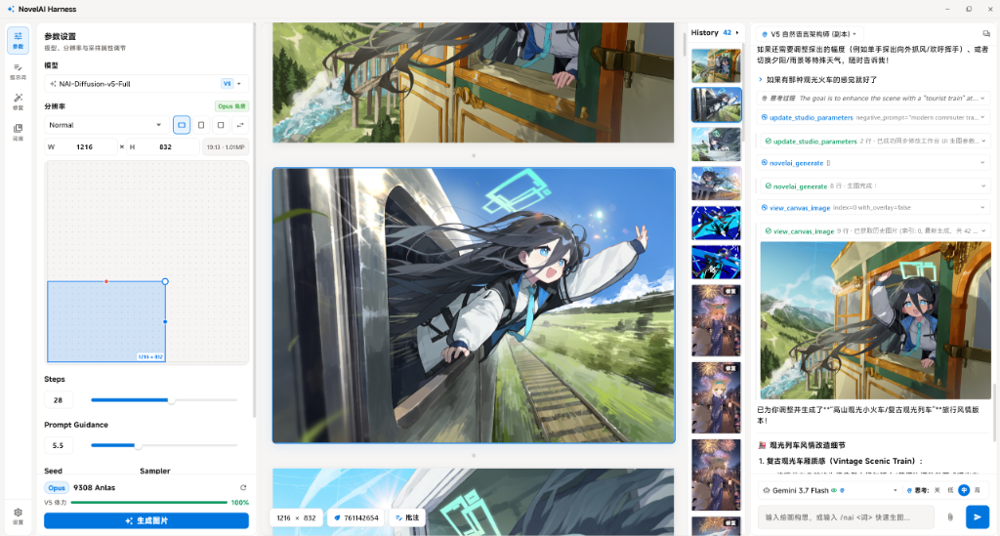
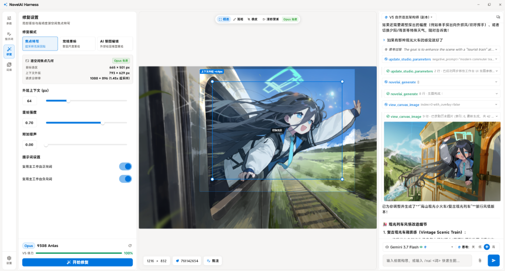
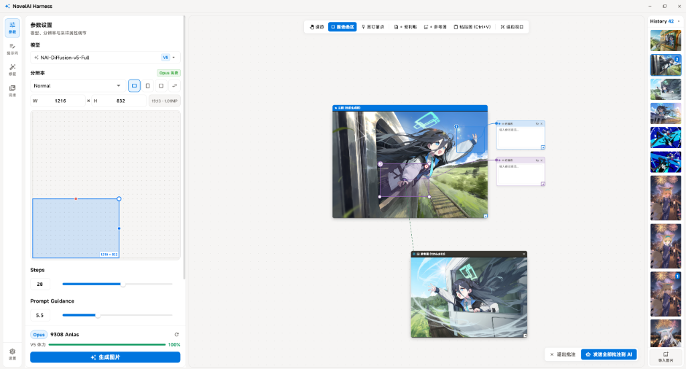

# NovelAI Harness

<p align="center">
  <strong>专为 NovelAI 图像生成与二次元视觉创作设计的极简化、响应式 Flutter AI Harness 工作台</strong>
</p>

<p align="center">
  
  
  
  
  
</p>

---

## 📸 界面预览

<p align="center">
  
</p>
<p align="center">
  <em>三卡片自适应工作台：参数设置、流式画板与 AI 对话协同</em>
</p>

<p align="center">
  
</p>
<p align="center">
  <em>局部修复与焦点特写：独立修复画板、潜空间超采样与无损回贴</em>
</p>

<p align="center">
  
</p>
<p align="center">
  <em>自由大画布：无限漫游缩放、参考图排布、批注圈选与便签动态连线</em>
</p>

---

## 📖 项目简介

**NovelAI Harness** 是一个面向 NovelAI 的桌面端二次元视觉创作工作台。它结合了 **极简 AI Harness 架构** 与 **三栏自适应界面**，将参数设置、图像画板、局部特写重绘、大画布批注、多角色定位、Danbooru 标签生态与 AI 对话交互整合在一起，提供纯粹、高效的二次元视觉创作体验。

### 🌟 核心设计

1. **极简 AI Harness 内核**：采用轻量级事件流与模块化技能驱动，保持低耦合与高扩展性。
2. **三卡片自适应工作台**：支持自由拖拽分割线的三栏结构（左：参数与提示词，中：图像画板，右：AI 对话），小屏自动降级适配。
3. **原生协议与并发安全**：严格遵循单并发排队、频控退避重试、内存数据解包与 Opus 免点保护规则。

---

## ✨ 核心特性

- 🎨 **三卡片自适应工作台**：
  - **参数与提示词**：支持 NovelAI Diffusion 全系模型、采样算法与噪声调度选择、2D 可视化分辨率板、正负提示词双模式与多角色扩展。
  - **交互图像画板**：流式生图渐进预览、历史图片缩略图轮播、全屏沉浸式看图与多角色画板拖拽排版。
  - **AI 对话中枢**：支持多轮流式对话、动态切换模型与思考强度、多模态图片收发与历史会话分支回溯。
- 🖌️ **局部修复与焦点特写 (Inpaint & Focus Inpaint)**：
  - 提供独立修复画板，支持矩形选区、画笔与橡皮擦自由遮罩。
  - **焦点特写超采样**：局部区域外延扩展并在 1MP 潜空间重绘，通过潜空间量化与平滑羽化无损回贴原图，消除接缝与色差。
  - 画板批注区域一键转入局部修复，保持提示词安全独立。
- 🤖 **外部模型 AI 整图编辑**：
  - 支持接入外部多模态绘图模型，通过自然语言指令对画板整图进行二次创作与重绘，自动保持比例与分辨率。
- 🗺️ **自由大画布与动态连线批注**：
  - 提供无限漫游缩放的自由大画布，支持导入多张参考图进行视觉对比。
  - 支持主图圈选、图钉标注，并通过动态连线绑定便签注释，可将整套视觉批注一键发送给 AI 进行协同分析。
- 🔒 **图像导出管道与水印系统**：
  - 支持可见水印 2D 定位与透明度调节，具备画面背景自适应对比度与智能避让留白选位。
  - 集成 Koch-Zhao DCT 频域盲水印隐写，具备抗截断与轻微压缩鲁棒性，支持画板一键提取还原。
  - 支持 NovelAI PNG 元数据查看、注入与脱敏抹除。
  - 支持独立未保存缓存机制，防止未定稿图片占用磁盘空间。
- ⚡ **NovelAI 协议适配与点数保护**：
  - 全面适配 NovelAI Diffusion V5/V4.5/V4/V3 及 Furry 系列模型。
  - 全局并发锁保护与 429 速率限制退避重试。
  - 内置精确的 Anlas 消耗计算，严格执行 Opus 免费档规则与 V5 体力池保护。
  - 适配官方新版 Multipart 超分协议，支持高倍率无损放大。
- 🏷️ **Danbooru 32万+ 离线/在线双轨标签体系**：
  - 内置 32万+ Danbooru 标签中英对照离线词库，毫秒级快速匹配与浮动自动补全。
  - 集成 DanbooruSearch 在线语义检索服务，支持自然语言搜词与擅长画师推荐。
  - 提供标签灵感库弹窗，精选高频标签与分类速查。
- 👥 **多角色可视化定位与防串色隔离**：
  - 深度支持 V5（自由连续坐标）与 V4/V4.5（5×5 网格）官方多角色协议。
  - 画板角色锚点交互拖拽，支持 AI 自动排版与自定义定位无缝切换。
  - 遵循 V5 管道符 `|` 物理防串色与独立角色提示词体系。
- 📝 **提示词编辑与语法高亮**：
  - 基于 AST 解析提示词结构，支持 `{}`/`[]` 权重即时增减、SD ⇄ NAI 语法双向转换与标签禁用切换。
  - 富文本语法高亮，根据 Danbooru 官方分类精确着色。
- 📚 **提示词组合预设库 (Prompt Combo Library)**：
  - 结构化管理角色、画风、服饰与场景等词组合预设，支持缩略图关联、导入导出与一键应用到工作台。
- 🖥️ **桌面原生交互体验**：
  - 支持拖入外部图片自动读取 NovelAI 参数并一键回填。
  - 支持剪贴板原生粘贴图片直接发送给 AI。
  - 平滑滚轮与节流渲染，确保高帧率流畅度。

---

## 📚 规约与文档索引

- [**`ARCHITECTURE.md`**](ARCHITECTURE.md)：完整工程目录结构、各层服务职责划分与核心管线设计。
- [**`AGENTS.md`**](AGENTS.md)：智能体最高行为准则、标准四阶段作业流程与核心 Never 红线。
- [**`THIRD_PARTY_NOTICES.md`**](THIRD_PARTY_NOTICES.md)：第三方开源依赖包清单、许可证全文与致谢声明。

---

## 🛠️ 快速开始与开发指南

### 环境要求

- [Flutter SDK](https://docs.flutter.dev/get-started/install) (`>= 3.12.0`)
- [Dart SDK](https://dart.dev/get-dart) (`>= 3.12.0`)
- 支持的操作系统：Windows 10/11、macOS 或 Linux

### 安装与运行

```bash
# 获取依赖
flutter pub get

# 启动桌面端应用程序
flutter run -d windows    # Windows
flutter run -d macos      # macOS
flutter run -d linux      # Linux
```

### 质量门禁 (Quality Gate)

修改代码后，必须通过以下两道门禁：

```bash
# 门禁 1: 静态代码分析 (必须 0 警告)
dart analyze

# 门禁 2: 全量自动化测试套件 (550+ 用例必须 100% 通过)
flutter test
```

---

## ⚠️ 第三方提醒与免责声明 (Notices & Disclaimers)

- **非官方产品**：本项目为第三方非官方开源工作台，与 **NovelAI (Anlatan, Inc.)** 官方无从属关系。使用前请自备合法 NovelAI 账号并遵守其服务条款。
- **费用提示**：NovelAI Anlas 点数扣除与第三方 LLM API Token 消耗均由用户各自账号承担。
- **凭证安全**：所有 API 密钥均仅保存在本地设备，绝不上传至任何第三方服务器。
- **完整声明**：关于在线服务可用性、数据源版权与字体许可的完整声明，请参阅 [**THIRD_PARTY_NOTICES.md**](THIRD_PARTY_NOTICES.md)。

---

## 📄 开源许可证 (License)

本项目采用 [MIT License](LICENSE) 许可证开源。请在使用前仔细阅读上述第三方提醒与免责声明。
